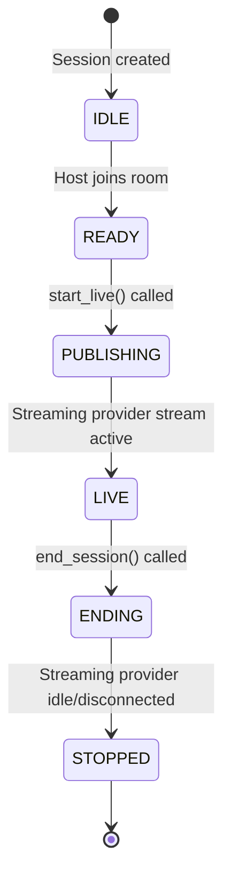
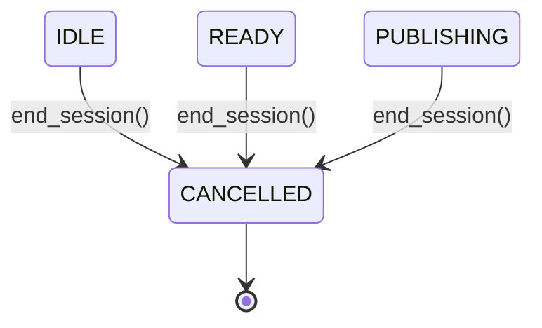
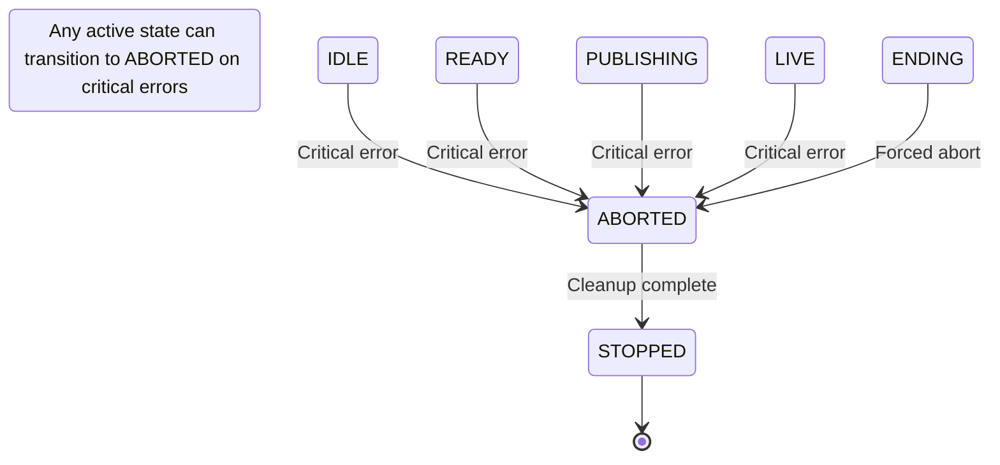
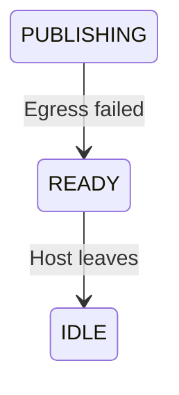

# Session State Machine

This document describes the session state machine, including all states, valid transitions, and the triggers that cause state changes.

## State Diagram

### Main Flow (Happy Path)



### Cancellation Flow (End Before Live)



### Error/Abort Flow



### Fallback Transitions



## States

| State        | Description                                     | Terminal? |
| ------------ | ----------------------------------------------- | --------- |
| `IDLE`       | Session created, awaiting host                  | No        |
| `READY`      | Host joined the room, ready to start streaming  | No        |
| `PUBLISHING` | Streaming started to provider, awaiting confirmation | No        |
| `LIVE`       | Stream confirmed active on provider CDN              | No        |
| `ENDING`     | Stream stop initiated, awaiting confirmation    | No        |
| `ABORTED`    | Stream failed unexpectedly                      | No        |
| `CANCELLED`  | Session cancelled before going live             | **Yes**   |
| `STOPPED`    | Stream confirmed stopped, session complete      | **Yes**   |

### Active States

States where a session is considered "active" (returned by `SessionState.active_states()`):

- `IDLE`, `READY`, `PUBLISHING`, `LIVE`, `ENDING`

## State Transitions

### Transition Map

| Current State | Valid Next States                            |
| ------------- | -------------------------------------------- |
| `IDLE`        | `READY`, `CANCELLED`, `ABORTED`              |
| `READY`       | `PUBLISHING`, `CANCELLED`, `IDLE`, `ABORTED` |
| `PUBLISHING`  | `LIVE`, `CANCELLED`, `READY`, `ABORTED`      |
| `LIVE`        | `ENDING`, `ABORTED`                          |
| `ENDING`      | `STOPPED`, `ABORTED`                         |
| `ABORTED`     | `STOPPED`                                    |
| `CANCELLED`   | _(none - terminal)_                          |
| `STOPPED`     | _(none - terminal)_                          |

### Transition Validation

All state transitions are validated by `SessionStateMachine.can_transition()` in `app/domain/live/session/session_state_machine.py`. The `update_session_state()` method in `_base.py` raises `ValueError` for invalid transitions.

---

## Triggers (Where State Changes Occur)

### 1. IDLE → READY

**Trigger**: Host joins the RTC room

**Location**:

- `app/api/webhooks/rtc.py` → `handle_participant_joined()` (sanitized path example)
- `app/api/routers/session_ingress.py` → `create_room()` endpoint (explicit room creation)

**Flow**:

```
Host joins room → RTC provider fires participant_joined webhook
                → handle_participant_joined() calls update_session_state(READY)
```

Or via explicit room creation:

```
Client calls POST /session/room → create_room() validates & creates room
                                → calls update_session_state(READY)
```

---

### 2. READY → PUBLISHING

**Trigger**: `start_live()` API called to begin streaming to provider

**Location**: `app/domain/live/session/_egress.py` → `start_live()`

**Flow**:

```
Client calls start-live endpoint → start_live() creates provider streaming session
                                 → starts RTC egress
                                 → calls update_session_state(PUBLISHING)
```

---

### 3. PUBLISHING → LIVE

**Trigger**: Provider webhook confirms stream is active

**Location**: `app/api/webhooks/mux.py` → `handle_live_stream_active()`

**Webhook Event**: `video.live_stream.active`

**Flow**:

```
RTC egress starts pushing to provider → streaming session becomes active
                                       → provider fires video.live_stream.active webhook
                                      → handle_live_stream_active() calls update_session_state(LIVE)
                                      → Notifies External Live platform via admin/live/start
```

---

### 4. LIVE → ENDING

**Trigger**: `end_session()` or `end_live()` API called on a live session

**Location**: `app/domain/live/session/_end.py` → `end_session()`

**Flow**:

```
Client calls end-session endpoint → end_session() determines target_state=ENDING (from LIVE)
                                  → stops egress
                                  → calls update_session_state(ENDING)
```

---

### 5. ENDING → STOPPED

**Trigger**: Provider webhook confirms stream is idle/disconnected OR RTC room is deleted

**Locations**:

- `app/api/webhooks/mux.py` → `handle_live_stream_idle()` (webhook: `video.live_stream.idle`)
- `app/api/webhooks/mux.py` → `handle_live_stream_disconnected()` (webhook: `video.live_stream.disconnected`)
- `app/api/webhooks/livekit.py` → `handle_room_finished()` (webhook: `room_finished`)

**Flow (Provider idle)**:

```
end_live() signals provider complete → streaming session goes idle
                                      → provider fires video.live_stream.idle webhook
                                → handle_live_stream_idle() calls update_session_state(STOPPED)
                                → Notifies External Live platform via admin/live/stop
                                → Optionally recreates a new READY session
```

**Flow (RTC room finished)**:

```
Room is deleted → RTC provider fires room_finished webhook
                → handle_room_finished() calls update_session_state(STOPPED)
```

---

### 6. {IDLE, READY, PUBLISHING} → CANCELLED

**Trigger**: `end_session()` called before the session goes live

**Location**: `app/domain/live/session/_end.py` → `end_session()`

**Flow**:

```
Client calls end-session on non-live session → end_session() determines target_state=CANCELLED
                                              → stops any pending egress
                                              → calls update_session_state(CANCELLED)
```

---

### 7. {Any Active State} → ABORTED

**Trigger**: Unexpected errors or failures during streaming

**Locations**:

- `app/domain/live/session/_egress.py` → on critical egress errors
- `app/domain/live/session/_end.py` → `end_session()` when called during ENDING state
- `app/api/webhooks/livekit.py` → `handle_room_finished()` when room deleted unexpectedly

**Flow (egress error)**:

```
Egress operation fails critically → error handler calls update_session_state(ABORTED)
```

**Flow (end during ENDING)**:

```
Client calls end-session while already ENDING → end_session() determines target_state=ABORTED
                                              → calls update_session_state(ABORTED)
```

**Flow (unexpected room deletion)**:

```
Room deleted while in active state → handle_room_finished()
                                    → if transition to STOPPED invalid, first transition to ABORTED
                                    → then transition ABORTED → STOPPED
```

---

### 8. ABORTED → STOPPED

**Trigger**: Cleanup after abort (usually automatic)

**Location**: `app/api/webhooks/livekit.py` → `handle_room_finished()`

**Flow**:

```
Session in ABORTED state → room cleanup/deletion
                         → handle_room_finished() calls update_session_state(STOPPED)
```

---

### 9. Fallback Transitions

#### READY → IDLE

**Trigger**: Host leaves before streaming starts (not currently implemented as automatic)

#### PUBLISHING → READY

**Trigger**: Egress fails to start, rollback to READY state (error recovery)

---

## State Update Mechanism

All state updates go through `BaseService.update_session_state()` in `app/domain/live/session/_base.py`:

```python
async def update_session_state(self, session: Session, new_state: SessionState) -> Session:
    # No-op if already in target state
    if session.status == new_state:
        return session

    # Validate transition
    if not SessionStateMachine.can_transition(session.status, new_state):
        raise ValueError(f"Invalid state transition: {session.status} -> {new_state}")

    # Update state and timestamps
    session.status = new_state
    session.updated_at = utc_now()

    # Lifecycle timestamps
    if new_state == SessionState.LIVE and not session.started_at:
        session.started_at = utc_now()
    elif new_state in {SessionState.STOPPED, SessionState.ABORTED, SessionState.CANCELLED}:
        if not session.stopped_at:
            session.stopped_at = utc_now()

    await session.save()
    return session
```

---

## Key Files Reference

| File                                               | Purpose                                                      |
| -------------------------------------------------- | ------------------------------------------------------------ |
| `app/schemas/session_state.py`                     | `SessionState` enum definition                               |
| `app/domain/live/session/session_state_machine.py` | `SessionStateMachine` class with transition rules            |
| `app/domain/live/session/_base.py`                 | `update_session_state()` method                              |
| `app/domain/live/session/_end.py`                  | `end_session()` logic                                        |
| `app/domain/live/session/_egress.py`               | `start_live()` and `end_live()` logic                        |
| `app/api/webhooks/rtc.py`                          | RTC webhook handlers (participant_joined, room_finished)     |
| `app/api/webhooks/streaming.py`                    | Streaming webhook handlers (stream active, idle, disconnected) |
| `app/api/routers/session_ingress.py`           | Room creation endpoint                                       |
